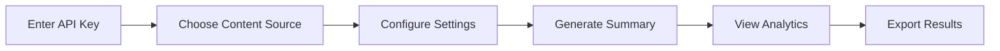

<div align="center">
  <h1>🚀 AI Content Summarizer Pro</h1>
  <p><strong>Transform any content into intelligent summaries with cutting-edge AI technology</strong></p>
  
  
  
  
  
  
  <br><br>
  
  
  
  <br><br>
  
  <a href="#features">Features</a> •
  <a href="#installation">Installation</a> •
  <a href="#usage">Usage</a> •
  <a href="#configuration">Configuration</a> •
  <a href="#contributing">Contributing</a>
</div>

---

## 🌟 Overview

This advanced Streamlit application leverages powerful AI models to provide comprehensive content analysis and summarization. Whether you're processing YouTube videos, web articles, Wikipedia pages, or direct text input, get instant, intelligent summaries with advanced analytics.

## ✨ Features

<table>
<tr>
<td>

### 📊 Advanced Analytics
- Real-time processing metrics
- Performance dashboard
- Historical analytics
- Usage trend visualization

### 🎯 Multiple Content Sources
- 🎥 YouTube Videos
- 🌐 Websites & Articles
- 📚 Wikipedia Pages
- 📝 Direct Text Input

</td>
<td>

### 🤖 AI Model Selection
- Gemma 2 9B (Recommended)
- Llama 3 8B (Fast)
- Mixtral 8x7B (Advanced)
- Llama 3 70B (Premium)

### 🔬 Advanced Analysis
- 😊 Sentiment Analysis
- 🔍 Keyword Extraction
- 📚 Readability Scoring
- ☁️ Word Cloud Generation

</td>
</tr>
</table>

### 📊 Advanced Analytics
- **Real-time Processing Metrics**: Track processing time, compression ratios, and word counts
- **Performance Dashboard**: Visualize usage trends and model performance
- **Historical Analytics**: Monitor your summarization patterns over time

### 🎯 Multiple Content Sources
- **🎥 YouTube Videos**: Extract and summarize video transcripts
- **🌐 Websites**: Analyze web articles and blog posts
- **📚 Wikipedia**: Research and summarize encyclopedia articles
- **📝 Direct Text**: Process any text content directly

### 🤖 AI Model Selection
- **Gemma 2 9B** (Recommended): Best balance of speed and quality
- **Llama 3 8B**: Lightning-fast processing
- **Mixtral 8x7B**: Advanced reasoning capabilities
- **Llama 3 70B**: Premium quality analysis

### 📋 Summary Types
| Type | Description | Best For |
|------|-------------|----------|
| 📋 Standard Summary | Comprehensive overview with key points | General use |
| 🎯 Executive Summary | Business-focused insights | Decision makers |
| 📖 Detailed Analysis | In-depth examination | Research |
| 🔍 Key Points Only | Essential information | Quick reference |
| 💡 Insights & Takeaways | Actionable learnings | Educational |
| 📊 Structured Report | Professional presentation | Business reports |

### 🌍 Multi-language Support
`English` • `Turkish` • `Spanish` • `French` • `German` • `Italian` • `Portuguese` • `Japanese` • `Korean` • `Chinese`

## 🛠️ Installation

### Prerequisites
- Python 3.8+
- [Groq API key](https://console.groq.com/) (free)

### Quick Start

1. **Clone the repository**
   ```bash
   git clone https://github.com/yourusername/ai-content-summarizer-pro.git
   cd ai-content-summarizer-pro
   ```

2. **Install dependencies**
   ```bash
   pip install -r requirements.txt
   ```

3. **Run the application**
   ```bash
   streamlit run app.py
   ```

4. **Configure your API key**
   - Get your free Groq API key from [console.groq.com](https://console.groq.com/)
   - Enter it in the sidebar configuration

### Requirements.txt
```txt
streamlit>=1.28.0
langchain>=0.1.0
langchain-groq>=0.1.0
langchain-community>=0.1.0
youtube-transcript-api>=0.6.0
pytube>=15.0.0
unstructured>=0.10.0
wikipedia>=1.4.0
plotly>=5.15.0
pandas>=2.0.0
validators>=0.20.0
textstat>=0.7.0
requests>=2.31.0
```

## 📖 Usage

### Basic Workflow


### Step-by-Step Guide

#### 1. 🔑 API Configuration
- Enter your Groq API key in the sidebar
- Select your preferred AI model

#### 2. 📥 Content Input
Choose one of the following options:
- **YouTube URL**: `https://youtube.com/watch?v=...`
- **Website URL**: Any valid web article or blog post
- **Wikipedia Search**: Enter a topic (e.g., "Machine Learning")
- **Direct Text**: Paste your content directly

#### 3. ⚙️ Configuration
- **Summary Type**: Choose from 6 different formats
- **Length**: 100-1000+ words
- **Language**: Select output language
- **Analysis**: Enable sentiment, keywords, readability, word cloud

#### 4. 🚀 Generate Summary
Click "Generate AI Summary" and watch the magic happen!

### Example URLs to Try
```
YouTube: https://www.youtube.com/watch?v=aircAruvnKk
Wikipedia: "Artificial Intelligence"
Website: https://www.bbc.com/news/technology
```

## 🔧 Configuration

### AI Models Comparison

| Model | Speed | Quality | Context | Best For |
|-------|-------|---------|---------|----------|
| Gemma 2 9B | ⚡ Fast | 🎯 High | 8K | **Recommended** |
| Llama 3 8B | 🚀 Very Fast | ✅ Good | 8K | Quick processing |
| Mixtral 8x7B | ⚡ Fast | 🌟 Excellent | 32K | Long content |
| Llama 3 70B | 🐌 Slow | 🏆 Premium | 8K | Best quality |

### Advanced Settings

<details>
<summary>📝 Summary Configuration</summary>

```python
# Summary lengths
LENGTHS = {
    "Short": "100-200 words",
    "Medium": "200-400 words", 
    "Long": "400-600 words",
    "Extended": "600-800 words",
    "Custom": "50-1000 words"
}

# Supported languages
LANGUAGES = {
    "English": "en", "Turkish": "tr", "Spanish": "es",
    "French": "fr", "German": "de", "Italian": "it",
    "Portuguese": "pt", "Japanese": "ja", "Korean": "ko", "Chinese": "zh"
}
```
</details>

<details>
<summary>🔬 Analysis Options</summary>

- **Sentiment Analysis**: Emotional tone detection
- **Keyword Extraction**: Important terms identification
- **Readability Scoring**: Flesch reading ease & grade level
- **Word Cloud**: Visual term representation
</details>

## 📊 Analytics & Performance

### Real-time Metrics
- ⏱️ **Processing Time**: 1-15 seconds depending on content
- 🗜️ **Compression Ratio**: Typically 5-20x reduction
- 📈 **Usage Trends**: Track your summarization patterns
- 🎯 **Model Performance**: Compare different AI models

### Performance Benchmarks
| Content Type | Avg Processing Time | Compression Ratio |
|--------------|-------------------|-------------------|
| YouTube Videos | 5-15 seconds | 10-20x |
| Web Articles | 3-10 seconds | 5-15x |
| Wikipedia Pages | 2-8 seconds | 8-18x |
| Direct Text | 1-5 seconds | 3-10x |

### Export Options
- 📄 **Text Report**: Complete analysis document
- 📊 **JSON Data**: Structured data for integration
- 📚 **History Export**: All summaries in one file

## 🎨 Screenshots

<details>
<summary>📸 View Application Screenshots</summary>

### Main Interface


### Analytics Dashboard


### Summary Results


</details>

## 🔧 Troubleshooting

<details>
<summary>🔑 API Key Issues</summary>

**Problem**: Invalid API key error
- ✅ Verify your key from [console.groq.com](https://console.groq.com/)
- ✅ Check for extra spaces or characters
- ✅ Ensure key starts with `gsk_`

**Problem**: Rate limit exceeded
- ✅ Wait a few minutes and try again
- ✅ Check your API usage limits
- ✅ Consider upgrading your plan

</details>

<details>
<summary>📥 Content Loading Issues</summary>

**YouTube Videos**
- Some videos may not have transcripts
- Private/restricted videos won't work
- Try different video URLs

**Websites**
- Some sites block automated access
- Check if the URL is accessible
- Try different article URLs

**Wikipedia**
- Use specific search terms
- Check spelling and language
- Try alternative topic names

</details>

<details>
<summary>⚡ Performance Issues</summary>

**Slow Processing**
- Switch to Llama 3 8B model (faster)
- Reduce content length
- Check your internet connection

**Memory Issues**
- Close other applications
- Use shorter content
- Restart the application

</details>

## 🚀 Roadmap

### 🔄 Version 2.0 (Coming Soon)
- [ ] REST API endpoints
- [ ] Batch processing
- [ ] Custom model fine-tuning
- [ ] Team collaboration features
- [ ] Advanced visualization

### 🎯 Version 2.1 (Planned)
- [ ] Mobile app
- [ ] Plugin system
- [ ] Integration with popular tools
- [ ] Advanced analytics ML insights
- [ ] Multi-user support

## 🤝 Contributing

We welcome contributions! Here's how you can help:

### 🐛 Report Issues
- Use GitHub Issues for bug reports
- Include detailed reproduction steps
- Add screenshots if applicable

### 💡 Suggest Features
- Open feature requests in Issues
- Describe the use case clearly
- Explain why it would be valuable

### 🔧 Submit Pull Requests
1. Fork the repository
2. Create a feature branch
3. Make your changes
4. Add tests if applicable
5. Submit a pull request

### 📖 Development Setup
```bash
# Clone your fork
git clone https://github.com/yourusername/ai-content-summarizer-pro.git

# Create virtual environment
python -m venv venv
source venv/bin/activate  # or venv\Scripts\activate on Windows

# Install dependencies
pip install -r requirements.txt

# Run in development mode
streamlit run app.py
```

## 📄 License

This project is licensed under the MIT License - see the [LICENSE](LICENSE) file for details.

## 🙏 Acknowledgments

- [Groq](https://groq.com/) for providing fast AI inference
- [LangChain](https://langchain.com/) for the powerful framework
- [Streamlit](https://streamlit.io/) for the amazing web framework
- All contributors who help improve this project

## 👨‍💻 Developer

<div align="center">
  
  <h3>Enes Aydin</h3>
  <p>AI Developer & Software Engineer</p>
  
  <a href="https://github.com/yourusername">
    
  </a>
  <a href="https://linkedin.com/in/yourprofile">
    
  </a>
  <a href="mailto:your.email@example.com">
    
  </a>
</div>

## 🌟 Star History

<div align="center">
  <a href="https://star-history.com/#yourusername/ai-content-summarizer-pro&Date">
    
  </a>
</div>

## 📈 Project Stats

<div align="center">
  
</div>

---

<div align="center">
  <h3>🚀 Transform Your Content with AI</h3>
  <p><strong>AI Content Summarizer Pro</strong> - Intelligent summarization powered by cutting-edge AI</p>
  <p>Made with ❤️ by <a href="https://github.com/yourusername">Enes Aydin</a></p>
  
  <br>
  
  <p>If you found this project helpful, please give it a ⭐!</p>
  
  <a href="https://github.com/yourusername/ai-content-summarizer-pro/stargazers">
    
  </a>
  <a href="https://github.com/yourusername/ai-content-summarizer-pro/network/members">
    
  </a>
  <a href="https://github.com/yourusername/ai-content-summarizer-pro/watchers">
    
  </a>
</div>
